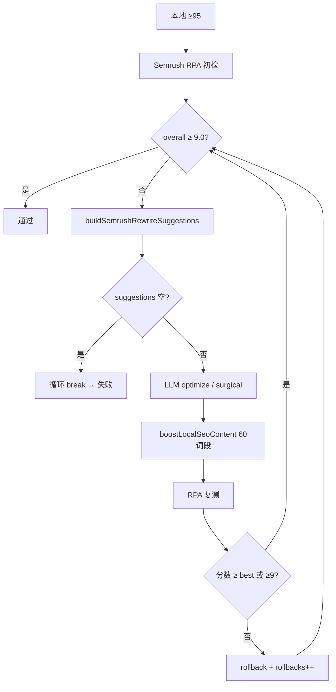

# SEO 评分流水线 — AI 交接文档（Semrush ≥9.0 攻关版）

> **目标**：让接手 AI 理解当前代码、定位「一直达不到 9 分」的原因，并给出可落地的代码/Prompt 修改方案。  
> **评分规则全文**：见 **§4**（本地五维 + Semrush 侧栏映射 + 验收判定）  
> **主入口**：`apps/platform/api/src/project-types/seo-factory/modules/seo-checker/seo-checker.service.ts`  
> **更新**：2026-06-17（反映近期改动：65 词段、语境化关键词、关键词保护锁、本地接受判定收紧）

---

## 0. 问题陈述（请优先解决）

**现象**：工作流 `optimizing` 阶段反复优化后，Semrush Overall Score 仍卡在 **8.x**，任务以 `BusinessException` 失败：

```
Semrush 评分 8.x，未达 9.0 分：{suggestions}
```

**验收标准**：`SEMRUSH_PASS_THRESHOLD = 9.0`（`constants/seo-score.ts`）

**不是本地分问题**：本地预检 ≥95 只是进门闸；Semrush 阶段本地分下降**不会触发回滚**，但 Semrush 分不涨就会失败。

---

## 1. 流水线总览

```
初稿 + 内链 + 配图
    ↓
[Phase A] 本地预检 (0–100, 门槛 95) — 可跳过（续跑时）
    ↓
[Phase B] Semrush RPA 初检 (0–10)
    ↓
[Phase C] Semrush 优化循环 — while overall < 9.0 && rounds < cap
    │   LLM 按侧栏改写 → boostLocalSeoContent → RPA 复测
    │   接受条件：semrushImproved || semrushPassing
    ↓
overall < 9.0 → 任务失败
```

工作流挂载点：`workflow.service.ts` → `optimizing` → `seoCheckerService.runPostDraftPipeline(ctx)`

---

## 2. 近期已改动的点（与旧版文档的差异）

| 改动 | 文件 | 说明 |
|------|------|------|
| 超长段阈值 80→**65** | `local-seo-score.ts` | `LOCAL_PARAGRAPH_MAX_WORDS=65`，metrics 改为 `longParagraphsOver65` |
| 移除硬编码 B2B 凑词句 | `semrush-keyword-coverage.util.ts` | 删除 `applySemrushKeywordGapFixes` 的 `"For procurement teams..."` 注入 |
| **语境化关键词融合** | `buildContextualKeywordWeavingInstruction` | 引导 H2 问句 / 症状描述 / 段内设问，附 9.5+ 样例 |
| 关键词灵活匹配 | `isSemrushKeywordPresentInContent` | 连字符变体、词形变化、介词插入（`grind teeth` ↔ `grinding their teeth`） |
| **关键词保护锁** | `collectPresentSeoPhrases` + `protectedSeoPhrases` | 可读性轮禁止 LLM 删改已命中 SEO 短语 |
| 本地接受判定收紧 | `shouldAcceptLocalCandidate` | keywordCoverage 掉分绝对拒绝；near-miss 仅可读性改善时容忍 −2 |
| 动态关键词密度 | `scoreKeywordCoverage` | 长尾 ≥4 词：出现 1 次即满分密度；3 词/短词不同阈值 |
| H2 模糊匹配 | `headingMatchesKeyword` | ≥3 词元时 60% 命中即可 |

---

## 3. 门槛与轮次（Semrush 相关）

```typescript
// constants/seo-score.ts
SEMRUSH_PASS_THRESHOLD = 9.0
SEMRUSH_MAX_OPTIMIZE_ROUNDS = 4
SEMRUSH_NEAR_MISS_MARGIN = 0.2      // 8.8+ 多 2 轮
SEMRUSH_ULTRA_NEAR_MISS_MARGIN = 0.1 // 8.9+ 多 2 轮 + 手术式
SEMRUSH_RETRY_EXTRA_ROUNDS = 4      // 续跑失败重试
```

`resolveSemrushOptimizeRoundCap(8.9, 0, false)` → 4+2+2 = **8 轮**  
`resolveSemrushOptimizeRoundCap(8.5, 0, false)` → **4 轮**

**本地轮次**（进门闸优化）：

```typescript
LOCAL_SEO_PASS_THRESHOLD = 95
LOCAL_SEO_MAX_OPTIMIZE_ROUNDS = 5
LOCAL_SEO_NEAR_MISS_MARGIN = 5        // 90–94 多 3 轮；94/95 再多 2 轮
LOCAL_SEO_NEAR_MISS_EXTRA_ROUNDS = 3
LOCAL_SEO_RETRY_EXTRA_ROUNDS = 3
```

`resolveLocalOptimizeRoundCap(94, 0, false)` → 5+3+2 = **10 轮**

---

## 4. 评分规则详解

> 实现：`packages/shared-core/src/seo/local-seo-score.ts`（本地）、`providers/semrush/*`（Semrush 侧栏/关键词）、`readability-fix.util.ts`（确定性修复）

### 4.1 本地预检总分公式

```
总分 = keywordCoverage + serpTermAlignment + structure + readability + contentDepth
     = 25 + 25 + 20 + 20 + 10 = 100
门槛：≥95 通过（LOCAL_SEO_PASS_THRESHOLD）
```

建议输出顺序（最多 8 条）：可读性 → 结构 → 关键词 → SERP → 深度。

### 4.2 keywordCoverage（满分 25）

按目标词**词数**分三档：

| 档位 | 条件 | 密度/出现规则 |
|------|------|--------------|
| **长尾** | ≥4 词 | 出现 ≥1 次即 +10（不算密度） |
| **中尾** | 3 词 | 出现 1–2 次 +10；或密度 0.3%–1.5% +10 |
| **短词** | 1–2 词 | 密度 0.5%–2.5% +10 |

密度：`density = (keywordHits × keywordWordCount) / wordCount`

**开篇（+7）**：前 200 字符，完整短语或词元模糊匹配（≥3 词元时 60% 命中）。

**H2（+8）**：`headingMatchesKeyword()` — 词形变体（foot/feet、单复数）、≥3 词元时 60% 命中。

各档未达标时见 `scoreKeywordCoverage` 内 `suggestions` 文案。

### 4.3 serpTermAlignment（满分 25）

1. 从 organic title（×2）+ snippet（×1）提取 token，算 TF-IDF，取 top **20**
2. `score = round(weightedHit / weightedTotal × 25)`
3. 无 SERP 数据 → 默认 **20 分**
4. 缺失词 → `recommendedKeywords`（最多 12 个）

### 4.4 structure（满分 20）

| 子项 | 分值 | 规则 |
|------|------|------|
| H2 | +8 | ≥ **4** 个 `##` |
| 篇幅 | +8 | 词数/target 在 **70%–105%** |
| | +4 | 105%–115% 或 50%–70% |
| 列表 | +4 | 存在 `^- ` 行 |

### 4.5 readability（满分 20，基线 20 再扣）

| 计数器 | 阈值 | 扣分 |
|--------|------|------|
| `longParagraphsOver65` | >65 词/段，允许 ≤1 段超标 | **−6** |
| `longSentencesOver22` | >22 词/句，允许 ≤2 句超标 | **−6** |
| `passiveVoiceHits` | `(is\|are\|was\|were\|been\|being) \w+ed`，>6 处 | **−2** |
| it is / there is/are | 全文存在 | **−2** |
| 复杂词 | utilize, facilitate, commence, leverage 等，>2 处 | **−2** |

**+1 分模式**：仅差 1 分时，只改 1 处长句/被动/列表，禁止加段或 SERP 凑句。

### 4.6 contentDepth（满分 10）

- ≥700 词 → +4
- unique terms ≥100 → +6

### 4.7 本地优化：触发与接受

**readabilityPriority** 开启条件：

- keywordCoverage 与 serpTermAlignment 均 25/25 但仍 <95；或
- near-miss（差 ≤5 分）且（差 ≤2 / 可读性 gap≥2 / 长句>2 / 长段>1 / 被动>6）

**contentCoverageMaxed**：关键词+SERP 满分 → Prompt 禁止再加 SERP 凑句。

**候选接受**（`shouldAcceptLocalCandidate`）：

- keywordCoverage 掉分 → **拒绝**
- 总分提升 → **接受**
- near-miss 且可读性改善且总分 ≥ best−2 → **接受**

**确定性 boost**：删填充词 → 拆 >22 词句 → 拆 >65 词段 → 压到 target×105%；仅 score 不降时采纳。

### 4.8 Semrush SWA 规则（0–10，侧栏驱动）

Overall 为 SWA 黑盒；代码通过侧栏 + 结构扫描驱动优化。

**侧栏规则映射**（`semrush-actionable.util.ts`）：

| category | 侧栏标题示例 | rule | 优先级 |
|----------|-------------|------|--------|
| tone | 最为随意的句子 | `casual_sentence` | **最高** |
| readability | 考虑使用主动语态 | `passive_voice` | 高 |
| readability | 替换太过复杂的词语 | `complex_word` | 高 |
| tone | 考虑移除或替换 | `filler_phrase` | 高 |
| readability | 段落太长 | `long_paragraph` | 高 |
| seo | 关键词未覆盖 | `keyword` | **最高** |

**结构阈值**：

| 项 | 本地 | Semrush boost/Prompt | SWA |
|----|------|---------------------|-----|
| 超长段 | >65 词 | ≤60 词、≤3 句 | 标紫 |
| 超长句 | >22 词 | ≤22 词 | 侧栏 |
| 可读性指数 | — | ≥70 | `semrushReadabilityScore` |

**关键词覆盖**（`isSemrushKeywordPresentInContent`）：Markdown strip → substring → 连字符变体 → **灵活词形/介词插入**（可能与 SWA exact 不一致，见 §9.2）。

**高分融合范式**（禁止 B2B 列表句）：

- 长尾作 H2 问句
- 口语词作症状/感受描述
- 段内设问定义

**篇幅**：current+80 < competitor → 增补；current > competitor+30 → 删减。

**手术式替换**：compatibility→fit, utilize→use, facilitate→help, Basically/Just/very 删除等。

### 4.9 验收判定汇总

| 阶段 | 通过 | 候选接受 |
|------|------|---------|
| 本地 | ≥95 | §4.7 |
| Semrush | ≥9.0 | `overall≥best` 或 `≥9.0` |

Semrush 轮不因本地分降而回滚；本地轮拒绝 keywordCoverage 掉分。

### 4.10 metrics 字段

`wordCount`, `keywordDensity`, `matchedSerpTerms/totalSerpTerms`, `h2Count`, `longSentencesOver22`（≤2）, `longParagraphsOver65`（≤1）, `passiveVoiceHits`（≤6）, 超长句/段抽样。

---

## 5. Phase A：本地预检（进门闸）

> 评分细则见 **§4**；本节仅保留流水线相关补充。

### 5.1 关键词保护锁（仅本地轮）

```typescript
protectedSeoPhrases: collectPresentSeoPhrases(content, [targetKeyword, ...keywordsForAi])
```

Prompt 注入 `CRITICAL SEO CONSTRAINT`：可读性拆句时 **不得删改** 已命中 SEO 短语。

**⚠️ 缺口**：Semrush 轮 `generateOptimize` **未传** `protectedSeoPhrases`（见 §9.1）。

---

## 6. Phase B：Semrush RPA 终检

### 6.1 调用链

```
runSemrushCheck → SemrushQueueService → SemrushRpaAdapter.checkScore()
```

环境：`SEMRUSH_ENABLED=true`

### 6.2 输出字段（优化轮依赖）

| 字段 | 用途 |
|------|------|
| `overall` | 0–10，唯一验收分 |
| `suggestionDetails` | readability / seo / tone / originality 侧栏文案 |
| `actionableIssues` | 结构化：quotes（原句）、terms（词）、rule |
| `semrushMissingTargetKeywords` | 目标词未覆盖 |
| `semrushMissingRecommendedKeywords` | 推荐词未覆盖 |
| `semrushCompetitorWordCount` | 竞品词数标杆 |
| `semrushCurrentWordCount` | SWA 检测词数 |
| `semrushReadabilityScore` | 可读性指数，<70 扣分 |

### 6.3 侧栏解析

`semrush-actionable.util.ts`：从 DOM innerText 提取随意句、被动句、复杂词、填充词。

调试脚本：

```bash
cd apps/platform/api && pnpm run build && node scripts/semrush-actionable-probe.mjs
```

---

## 7. Phase C：Semrush 优化循环（核心）

实现：`seo-checker.service.ts` → `executeSemrushOptimizeRounds()`

### 7.1 单轮流程

```
1. buildSemrushRewriteSuggestions(semrushResult, content)  // 合并侧栏 + 结构诊断
2. if suggestions.length === 0 → break  // ⚠️ 会直接退出循环
3. semrushOptimizeRounds += 1
4. if ultraNearMiss(≥8.9) || consecutiveRollbacks ≥ 2:
       applySemrushNearMissDeterministicFixes
       if buildSemrushNearMissSurgicalInstruction → generateSemrushNearMissRewrite
       else → generateOptimize(semrush)
   else:
       generateOptimize(semrush)
5. boostLocalSeoContent(60词/3句/段, convertInlineLists)
6. runSemrushCheck → candidateSemrush
7. if candidate.overall >= best → 保留
   else → revertDraftContent(best) + consecutiveRollbacks++
```

### 7.2 建议合并（`buildSemrushRewriteSuggestions`）

优先级（unshift，最多 28 条）：

1. **`[SEO·语境融合·必做]`** — `buildContextualKeywordWeavingInstruction(missingKeywords)`
2. `actionableIssues` 原句改写（被动/随意/复杂词）
3. 超长段/句结构诊断（60 词段、22 词句）
4. 词数 vs 竞品标杆（过短 +80 词差距须增补）
5. 可读性指数 <70
6. 侧栏四类建议
7. `[Semrush·必做]` near-miss 提示（差 ≤0.2 分）

语境融合指令示例（禁止列表堆砌）：

```
[SEO·语境融合·必做] 文章缺失核心 SEO 短语：cell balancing, thermal runaway...
请不要将它们罗列为枯燥的列表...
1) 将长尾词作为 H2/H3 问句标题
2) 将口语化词汇作为患者主观感受写进描述段落
3) 作为段内自然设问或定义句出现
9.5+ 高分样例：...
```

### 7.3 LLM Prompt 块（Semrush 轮）

`openai-compatible.adapter.ts` → `buildReadabilityPriorityBlock`（`optimizePhase === 'semrush'`）：

- 拆 **60 词**段、**22 词**句
- 改写所有随意句、删填充词
- **语境融合** SWA 推荐词（禁止 list sentences）
- `pointsToGo ≤ 0.1` 时附加 **SURGICAL EDITS ONLY**
- `buildSeoProtectionBlock` 仅在传入 `protectedSeoPhrases` 时生效

Prompt 槽位：`semrushOptimize`（区别于 `localOptimize`）

### 7.4 接受 / 回滚

```typescript
semrushImproved = candidateSemrush.overall >= bestSemrushScore;
semrushPassing = candidateSemrush.overall >= 9.0;
shouldAcceptSemrushCandidate(semrushImproved, semrushPassing);
// = semrushImproved || semrushPassing
```

含义：

- 分数**持平**（8.7→8.7）→ **接受**（不 rollback）
- 分数**下降**（8.8→8.6）→ **回滚**到历史最佳稿
- 连续回滚 ≥2 → 进入手术式模式

### 7.5 手术式 near-miss（8.9→9.0）

`semrush-near-miss.util.ts`：

- 触发：`overall >= 8.9` 或 `consecutiveSemrushRollbacks >= 2`
- 确定性替换：compatibility→fit, utilize→use, Basically/Just/very 删除
- `buildSemrushNearMissSurgicalInstruction` **仅在**有随意句 quotes 或复杂词时返回非 null
- **若返回 null** → 回退到整篇 `generateOptimize`（可能把分打低）

---

## 8. 阈值不一致表（疑似扣分来源）

| 规则 | 本地预检 | Semrush boost | SWA 侧栏（观测） |
|------|---------|---------------|-----------------|
| 超长段 | **>65** 词 | 拆到 **≤60** 词 | 编辑器标紫「段落太长」 |
| 超长句 | **>22** 词 | ≤22 词 | 一致 |
| 篇幅上限 | 目标 × **105%** | 竞品词数或 Brief 目标 | 竞品 recommendations.length |

本地 65–60 词之间的段：本地可能不扣分，但 SWA 仍可能标紫。

---

## 9. 「达不到 9 分」— 代码级嫌疑清单（请接手 AI 优先验证）

### 9.1 🔴 Semrush 轮未传 `protectedSeoPhrases`

**位置**：`executeSemrushOptimizeRounds` 内两处 `generateOptimize({ phase: 'semrush', ... })`  
**对比**：本地轮有 `protectedSeoPhrases: collectProtectedSeoPhrases(...)`  
**风险**：可读性拆句时 LLM 删掉刚融入的 SWA 关键词 → 侧栏仍报 SEO 缺口 → 分数不涨或下降后 rollback

**建议修复**：Semrush 轮同样传入：

```typescript
protectedSeoPhrases: this.collectProtectedSeoPhrases(
  currentContent,
  ctx.targetKeyword,
  keywordsForAi,
),
```

### 9.2 🔴 关键词「已覆盖」误判

`isSemrushKeywordPresentInContent` 使用灵活匹配（词形、介词插入），**SWA 可能要求原词 exact match**。

结果：`semrushMissingTargetKeywords` 为空 → 不生成语境融合指令 → LLM 不知道要补词。

**验证**：对比 `seoCheckData.semrush.semrushMissing*` 与 SWA 侧栏灰色 Tag 是否一致。  
**调试**：`node scripts/semrush-keyword-coverage.util.test.mjs`

### 9.3 🔴 移除 `applySemrushKeywordGapFixes` 后纯靠 LLM 融词

旧逻辑：优化轮前**确定性**插入一句补词。  
现逻辑：仅在 `rewriteSuggestions` 里给 Prompt，LLM 可能忽略。

**建议**：在 Semrush 轮 LLM 之前，对 `missingKeywords` 尝试确定性 H2 问句注入（长尾 ≥4 词），而非 B2B 列表句。

### 9.4 🟠 `buildSemrushNearMissSurgicalInstruction` 返回 null

当分数 8.5–8.8、侧栏只有 SEO/篇幅问题、无随意句 quotes 时：

- `useSurgicalMode` 可能为 false（除非 rollbacks≥2）
- 或 surgical 为 null → 整篇 optimize → 常见 regression → rollback 死循环

**建议**：8.8+ 且无 surgical 目标时，改为「仅 SEO 补缺」轻量 Prompt，禁止改结构。

### 9.5 🟠 `rewriteSuggestions.length === 0` 提前 break

若 RPA 返回分数但 `suggestionDetails` 为空（抓取失败），循环直接退出，**不再优化**。

**建议**：空 suggestions 时注入 fallback（结构扫描 + missing keywords）。

### 9.6 🟠 轮次耗尽

8.5 分起始仅 **4 轮**；若每轮 rollback 或分数持平，可能永远差 0.5。

**建议**：记录 `optimizeHistory` 中 `rolledBack` 比例；8.7+ 且连续 2 轮无提升时自动扩 cap 或切换策略。

### 9.7 🟠 RPA 分数波动

`pickOverallScore` DOM/API 合并；复测时 ±0.1 波动可能导致 rollback 丢掉更好稿。

**建议**：接受 `candidate >= best - 0.05` 且 missing keywords 减少。

### 9.8 🟡 `boostLocalSeoContent` 在 Semrush 轮后执行

确定性拆段可能**破坏** LLM 刚做的语境融合（拆断含关键词的句子）。

**建议**：boost 后重新 `enrichSemrushKeywordCoverage` 并若缺词则拒绝该候选。

### 9.9 🟡 随意句检测不全

`extractSemrushCasualSentenceQuotes` 依赖侧栏 DOM 解析；解析失败 → 手术式无目标 → 8.9 卡死。

**验证**：`semrush-actionable-probe.mjs` 看 `actionableIssues` 是否为空。

---

## 10. 排查数据从哪里看

### 10.1 数据库 `articleJob`

| 字段 | 看什么 |
|------|--------|
| `semrushScore` | 最终/当前 Semrush 分 |
| `localSeoScore` | 本地分（参考） |
| `seoCheckData.semrush` | overall, suggestionDetails, actionableIssues, missing* |
| `seoCheckData.workflowProgress` | 当前 phase/round/message |
| `draftData.optimizeHistory` | 每轮 scoreBefore/After, rolledBack, rollbackReason |
| `draftData.content` | 最终正文 |

### 10.2 日志 action

```
seo_checker.semrush_optimize
seo_checker.semrush_optimize_rollback   // 关注 candidateSemrush vs bestSemrush
seo_checker.completed
```

### 10.3 单元测试

```bash
cd apps/platform/api
pnpm run build
node scripts/local-seo-score.test.mjs
node scripts/semrush-optimize.util.test.mjs
node scripts/semrush-keyword-coverage.util.test.mjs
node scripts/semrush-actionable.util.test.mjs
```

---

## 11. 接手 AI 建议修改优先级

| 优先级 | 修改 | 预期效果 |
|--------|------|---------|
| P0 | Semrush 轮传入 `protectedSeoPhrases` | 可读性改写不再丢词 |
| P0 | 校验 flexible match vs SWA exact；缺失词与侧栏对齐 | 融词指令不漏 |
| P1 | 长尾缺词：确定性 H2 问句注入（替代 B2B 列表句） | SEO 维度快速 +0.2~0.5 |
| P1 | `suggestions.length===0` 时不 break，用 fallback | 避免空跑 |
| P2 | 8.8+ 无 surgical 目标 → SEO-only 轻量轮 | 减少 regression |
| P2 | near-miss 接受：`missingKeywords` 减少即可保留 | 减少无效 rollback |
| P3 | 统一段落阈值为 60（本地也改）或 boost 更激进 | 减少 SWA 紫段 |

---

## 12. 核心代码索引

```
seo-checker.service.ts
  runPostDraftPipeline()           # 总编排
  executeSemrushOptimizeRounds()   # Semrush 优化循环 ★
  collectProtectedSeoPhrases()   # 关键词保护锁

constants/seo-score.ts             # 门槛与轮次
utils/seo-pipeline.util.ts         # shouldAcceptLocalCandidate, shouldAcceptSemrushCandidate
utils/semrush-optimize.util.ts     # buildSemrushRewriteSuggestions ★
utils/semrush-near-miss.util.ts    # 手术式改写
providers/semrush/semrush-keyword-coverage.util.ts  # 语境融合 ★
providers/semrush/semrush-actionable.util.ts        # 侧栏解析
providers/semrush/semrush-rpa.adapter.ts            # RPA 查分
providers/llm/openai-compatible.adapter.ts          # optimize Prompt ★
packages/shared-core/src/seo/local-seo-score.ts     # 本地打分
packages/shared-core/src/seo/readability-fix.util.ts # boostLocalSeoContent
```

---

## 13. 关键代码片段（当前版本）

### 13.1 Semrush 优化循环入口

```typescript
// seo-checker.service.ts — executeSemrushOptimizeRounds
while (!semrushResult.skipped && semrushResult.overall < 9.0 && rounds < cap) {
  const rewriteSuggestions = buildSemrushRewriteSuggestions(semrushResult, currentContent);
  if (rewriteSuggestions.length === 0) break;

  const useSurgicalMode = isSemrushUltraNearMiss(bestSemrushScore) || consecutiveRollbacks >= 2;
  // ... generateOptimize(phase:'semrush') — 注意：无 protectedSeoPhrases
  currentContent = boostLocalSeoContent(currentContent, buildSemrushBoostOptions(...));
  const candidateSemrush = await runSemrushCheck(...);

  if (candidateSemrush.overall >= bestSemrushScore || candidateSemrush.overall >= 9.0) {
    // keep
  } else {
    revertDraftContent(bestSemrushContent);
    consecutiveSemrushRollbacks++;
  }
}
```

### 13.2 语境化关键词指令

```typescript
// semrush-keyword-coverage.util.ts
export function buildContextualKeywordWeavingInstruction(missingKeywords: string[]): string {
  return [
    `[SEO·语境融合·必做] 文章缺失核心 SEO 短语：${preview}...`,
    '请不要将它们罗列为枯燥的列表...（禁止 "For procurement teams..."）',
    '1) 将长尾词作为 H2/H3 问句标题',
    '2) 将口语化词汇作为患者主观感受写进描述段落',
    '3) 作为段内自然设问或定义句出现',
    '9.5+ 高分样例：...',
  ].join('\n');
}
```

### 13.3 Semrush 接受判定

```typescript
// utils/seo-pipeline.util.ts
export function shouldAcceptSemrushCandidate(semrushImproved: boolean, semrushPassing: boolean) {
  return semrushImproved || semrushPassing;
}
```

### 13.4 本地接受判定

```typescript
export function shouldAcceptLocalCandidate(input: {
  candidateScore: number;
  bestScore: number;
  candidateKeywordCoverage: number;
  bestKeywordCoverage: number;
  nearMiss: boolean;
  readabilityImproved: boolean;
}): boolean {
  if (input.candidateKeywordCoverage < input.bestKeywordCoverage) return false;
  if (input.candidateScore >= input.bestScore) return true;
  return input.nearMiss && input.readabilityImproved && input.candidateScore >= input.bestScore - 2;
}
```

---

## 14. 流程图



---

## 15. 相关文档

- 完整规则说明：`docs/specs/seo-scoring-pipeline.md`
- 稿件编辑与评分失效：`docs/specs/draft-manual-edit.md`

---

## 16. 给接手 AI 的执行清单

1. 读一篇失败任务的 `seoCheckData` + `optimizeHistory`，确认卡在几分、rollback 几次、suggestions 内容
2. 跑 `semrush-actionable-probe.mjs` 确认侧栏解析是否完整
3. 先改 **P0**（`protectedSeoPhrases` 传入 Semrush 轮）
4. 对比 SWA 灰色 Tag 与 `semrushMissing*` 是否一致，修匹配逻辑
5. 加/integration 测试：模拟 8.8 分 + missing keywords → 优化后 keywords 不减少
6. 重跑一篇完整 job，目标 Semrush ≥9.0
