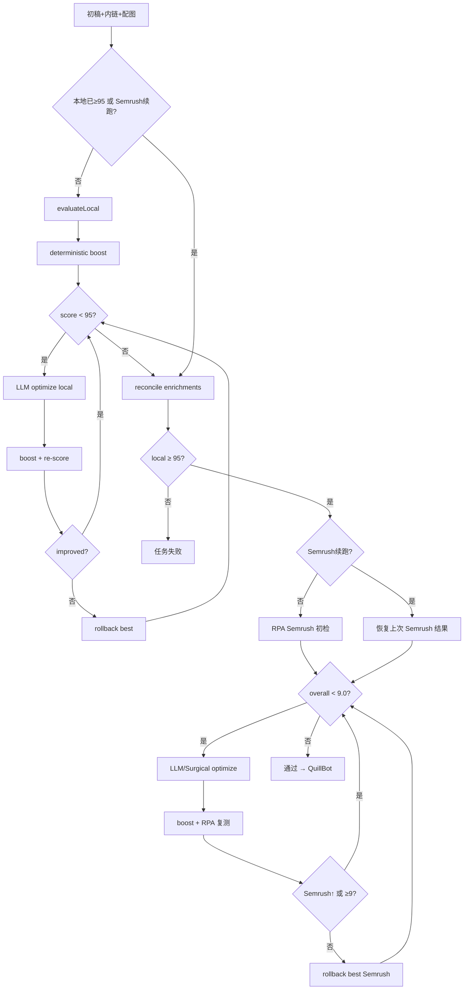

# SEO 评分流程规则（供审查与优化）

> 用途：供外部 AI 或团队成员审查、优化本地预检与 Semrush 终检规则。  
> 代码锚点：`apps/platform/api/src/project-types/seo-factory/modules/seo-checker/seo-checker.service.ts`  
> **Semrush 达不到 9 分攻关**：见 [`seo-scoring-handoff.md`](./seo-scoring-handoff.md)（**§4 完整评分规则**、嫌疑清单、P0 修复建议）

---

## 1. 总体架构

文章生成工作流在 **内链 → 配图** 之后进入 `optimizing` 步骤，由 `SeoCheckerService.runPostDraftPipeline()` 执行完整评分流水线。

```
SERP → Brief → 初稿 → 内链 → 配图 → [optimizing: SEO评分] → QuillBot → YMYL → 导出
```

工作流步骤定义见 `apps/platform/api/src/project-types/seo-factory/constants/workflow-resume.ts`：

```typescript
export const WORKFLOW_STEPS = [
  'serp', 'brief', 'draft', 'linking', 'images',
  'optimizing',   // ← SEO 评分
  'paraphrasing', 'ymyl',
] as const;
```

`optimizing` 步骤在 `WorkflowService` 中调用：

```typescript
optimizing: async () => {
  await this.updateStatus(jobId, 'OPTIMIZING');
  await this.seoCheckerService.runPostDraftPipeline(ctx);
},
```

### 1.1 双层评分模型

| 层级 | 分数范围 | 门槛 | 角色 |
|------|---------|------|------|
| **本地预检** | 0–100 | **≥95** | 进门闸：关键词/SERP/结构/可读性启发式，规则对齐 Semrush SWA |
| **Semrush 终检** | 0–10 | **≥9.0** | 权威分：任务是否通过、发布验收均以 Semrush 为准 |

核心原则（`constants/seo-score.ts`）：

- 本地分 = 预检进门闸；Semrush 阶段**不再因本地分下降而回滚**
- Semrush 优化轮的接受条件：`semrushImproved || semrushPassing`（只看 Semrush 是否提升或达标）

---

## 2. 门槛与轮次常量

文件：`apps/platform/api/src/project-types/seo-factory/constants/seo-score.ts`

```typescript
/** 本地预检通过线（进门闸；终检以 Semrush ≥9.0 为准） */
export const LOCAL_SEO_PASS_THRESHOLD = 95;

/** 本地优化最大轮次 */
export const LOCAL_SEO_MAX_OPTIMIZE_ROUNDS = 5;

/** 距门槛在此分差内仍追加改写（如 94/95） */
export const LOCAL_SEO_NEAR_MISS_MARGIN = 5;

/** 接近门槛时的额外改写轮次 */
export const LOCAL_SEO_NEAR_MISS_EXTRA_ROUNDS = 3;

/** 失败重试时，在已用满常规轮次后追加的改写轮次 */
export const LOCAL_SEO_RETRY_EXTRA_ROUNDS = 3;

/** Semrush 未达标时，按侧栏建议改写初稿的最大轮次 */
export const SEMRUSH_MAX_OPTIMIZE_ROUNDS = 4;

/** 距 Semrush 门槛在此分差内仍追加改写（如 8.8/9.0） */
export const SEMRUSH_NEAR_MISS_MARGIN = 0.2;

/** Semrush 接近门槛时的额外改写轮次 */
export const SEMRUSH_NEAR_MISS_EXTRA_ROUNDS = 2;

/** Semrush 失败重试时，在已用满常规轮次后追加的改写轮次 */
export const SEMRUSH_RETRY_EXTRA_ROUNDS = 4;

/** 极接近 Semrush 及格线（如 8.9/9.0）时追加的改写轮次 */
export const SEMRUSH_ULTRA_NEAR_MISS_MARGIN = 0.1;

/** 极接近及格线时的额外改写轮次 */
export const SEMRUSH_ULTRA_NEAR_MISS_EXTRA_ROUNDS = 2;

/** Semrush Overall Score 通过线 */
export const SEMRUSH_PASS_THRESHOLD = 9.0;
```

轮次上限计算：`utils/seo-pipeline.util.ts`

- `resolveLocalOptimizeRoundCap(bestScore, completedRounds, isLocalResume)`
- `resolveSemrushOptimizeRoundCap(bestScore, completedRounds, isSemrushResume)`

---

## 3. 本地预检评分规则（0–100）

核心实现：`packages/shared-core/src/seo/local-seo-score.ts` → `scoreLocalSeo()`

### 3.1 五维打分（满分 100）

| 维度 | 满分 | 规则摘要 |
|------|------|---------|
| **keywordCoverage** | 25 | 前 200 字符含目标词 +7；**动态密度**（见 3.1.1）；H2 **模糊匹配**（词元乱序/介词插入）+8 |
| **serpTermAlignment** | 25 | 从 SERP organic title/snippet 提取 TF-IDF top20 实体词，按 IDF 加权命中率计分 |
| **structure** | 20 | H2≥4 +8；篇幅 70%–105% 目标词数 +8（偏长/过短扣分）；有列表 +4 |
| **readability** | 20 | 基线 20，扣分项见下表 |
| **contentDepth** | 10 | ≥700 词 +4；unique terms ≥100 +6 |

### 3.1.1 关键词动态密度（`scoreKeywordCoverage`）

| 词长 | 密度规则 |
|------|---------|
| 1–2 词 | 0.5%–2.5% 满分；0.25%–3.5% 部分分 |
| 3 词 | 0.3%–1.5% 满分；出现 ≥1 次可部分得分 |
| ≥4 词（长尾） | **不考核密度**；全文自然出现 ≥1 次即满分 |

H2 匹配：`headingMatchesKeyword()` — 关键词全部词元出现在 H2 即可（如 `cure blistered feet` ↔ `Is There a Cure for Blistered Feet`）。

### 3.2 可读性扣分规则（与 Semrush SWA 对齐）

| 条件 | 扣分 |
|------|------|
| >65 词段落 >1 个 | −6 |
| >22 词句子 >2 条 | −6 |
| 被动语态命中 >6 处 | −2 |
| 含 `it is` / `there is` | −2 |
| 复杂词（utilize, facilitate 等）>2 处 | −2 |

被动语态检测正则：`\b(is|are|was|were|been|being)\s+\w+ed\b`

**注意**：长句阈值为 **>22 词**（不是 25）。

### 3.3 SERP 实体词提取

`extractSerpTerms()`：

- 从 organic 结果的 title（权重 ×2）和 snippet（权重 ×1）分词
- 过滤英文 stopwords、长度 <3、与目标词重复的 token
- 按 `tf × idf` 排序取 top 20
- 正文缺失词写入 `recommendedKeywords` 供 LLM 自然嵌入

### 3.4 确定性提分（不改 LLM）

`packages/shared-core/src/seo/readability-fix.util.ts` → `boostLocalSeoContent()`

执行顺序：

1. 删填充词（Basically, Just, very）
2. 拆超长句（`applyReadabilitySentenceFix`，阈值 22 词）
3. 拆超长段（默认 **65 词**（`LOCAL_PARAGRAPH_MAX_WORDS`）；Semrush 轮用 60 词 / 3 句）
4. 篇幅压到目标词数 **105%** 以内（`STRUCTURE_MAX_RATIO = 1.05`）
5. 可选：行内 `-` 枚举转列表（`convertInlineLists`，Semrush 轮启用）

仅在 `result.score >= baselineScore` 时采纳（`SeoCheckerService.applyDeterministicLocalBoost`）。

### 3.5 提分计划生成

`buildLocalScoreGapPlan(result, targetScore=95)`：按维度缺口排序，列出可读性计数器与「+1 分模式」指令。

### 3.6 9.5+ 高分样例范式（生产逆向）

| 样例文章 | Semrush | 关键词融合方式 |
|---------|---------|---------------|
| Foot Skin Blisters | 9.6 | 长尾作问句 H2：`## How Can I Get Rid of Blisters on Feet?`；`## Is There a Cure for Blistered Feet?` |
| Magnesium Teeth Grinding | 9.5 | 口语症状：`teeth crunching at night`；段内设问：`What is grinding of teeth?` |

Prompt 与 `buildContextualKeywordWeavingInstruction()` 均引用上述范式；禁止 B2B 凑句列表。

---

## 4. 本地优化循环

入口：`SeoCheckerService.runPostDraftPipeline()` 第一阶段

### 4.1 流程

```
evaluateLocal(初稿)
  ↓
[可选] applyDeterministicLocalBoost（优化前）
  ↓
recordOptimizeSnapshot(round=0, kind='baseline')
  ↓
while score < 95 && rounds < localRoundCap:
    buildLocalOptimizeContext → suggestions + scoreGapPlan
    LLM generateOptimize(phase='local')
    boostLocalSeoContent
    evaluateLocal(候选稿)
    if improved → 保留
    else → revertDraftContent(最佳稿)
    persistLocalSeoProgress
  ↓
[可选] applyDeterministicLocalBoost（优化后）
  ↓
reconcileDraftEnrichments（恢复内链/配图）
  ↓
score < 95 → throw BusinessException（任务失败）
```

### 4.2 本地「改进」判定（含 near-miss 宽容）

```typescript
const nearMiss = bestLocalScore >= LOCAL_SEO_PASS_THRESHOLD - LOCAL_SEO_NEAR_MISS_MARGIN;

const longSentencesImproved =
  candidateResult.metrics.longSentencesOver22 <= 2 &&
  candidateResult.metrics.longSentencesOver22 < bestLocalResult.metrics.longSentencesOver22;

const longParagraphsImproved =
  candidateResult.metrics.longParagraphsOver65 <= 1 &&
  candidateResult.metrics.longParagraphsOver65 < bestLocalResult.metrics.longParagraphsOver65;

const improved = shouldAcceptLocalCandidate({
  candidateScore, bestScore, candidateKeywordCoverage, bestKeywordCoverage,
  nearMiss, readabilityImproved: longSentencesImproved || longParagraphsImproved,
});
// 规则：总分可 near-miss 波动 −2，但 keywordCoverage 掉分绝对拒绝
```

### 4.3 LLM 优化上下文

`buildLocalOptimizeContext()` 生成：

| 字段 | 含义 |
|------|------|
| `readabilityPriority` | 关键词/SERP 已满且仍差分，或 near-miss 时长句/长段/被动超标 |
| `scoreGapPlan` | `buildLocalScoreGapPlan()` 逐项列维度缺口 |
| `readabilityAudit` | 超长句/段原文抽样 |
| `contentCoverageMaxed` | keywordCoverage≥25 且 serpTermAlignment≥25 |
| `protectedSeoPhrases` | 可读性轮注入 LLM：已命中 SEO 短语禁止删改 |
| `+1 分模式` | 差 1 分时只允许最小改动（拆 1 句 / 删 1 被动 / 补 1 列表） |

LLM 调用链：`LlmService.generateOptimize()` → `openai-compatible.adapter.ts`

### 4.4 续跑跳过本地

`utils/seo-pipeline.util.ts`：

```typescript
// 本地已达标时跳过本地优化（续跑 Semrush）
shouldSkipLocalOptimization(localSeoScore, seoCheck) {
  return (localSeoScore ?? 0) >= 95 || seoCheck.local?.passed === true;
}

// 续跑 Semrush 时跳过本地优化与进门闸
shouldSkipLocalPipeline(localAlreadyPassed, semrushResumable) {
  return localAlreadyPassed || semrushResumable;
}

// Semrush 未达标且有初检基线时可续跑，不重复 RPA 初检
canResumeSemrushOptimization(semrushScore, seoCheck, history) {
  if (semrushScore == null || semrushScore >= 9.0) return false;
  if (!semrush || semrush.skipped || semrush.passed === true) return false;
  return hasOptimizeBaseline(history, 'semrush');
}
```

---

## 5. Semrush 终检

### 5.1 调用链

```
runSemrushCheck(input, ctx)
  → SemrushQueueService.runCheck()
  → SemrushRpaAdapter.checkScore()   // Playwright RPA，3ue 节点
```

前置条件：环境变量 `SEMRUSH_ENABLED=true`

### 5.2 RPA 行为摘要

文件：`providers/semrush/semrush-rpa.adapter.ts`

1. 打开 Semrush SEO Writing Assistant (SWA)
2. 填入目标词 + 推荐词 + 正文
3. 拦截 `/swa/api/recommendations` API + DOM 侧栏抓取
4. 分数解析：DOM 与 API 双源，`pickOverallScore` 取稳定值（0.1–10 有效）
5. 等待分数稳定：连续多次 poll 差值 <0.05
6. 侧栏建议分类：`readability / seo / tone / originality`
7. 结构化改动点：`actionableIssues`（被动句、随意句、复杂词、关键词等）
8. 关键词覆盖：`enrichSemrushKeywordCoverage()` 比对正文 vs 目标词/推荐词

### 5.3 返回数据结构

接口：`packages/provider-interfaces/src/seo-checker-provider.interface.ts`

```typescript
interface SeoScore {
  overall: number;                    // 0–10
  suggestions: string[];
  semrushRecommendedKeywords?: string[];
  semrushTargetKeywords?: string[];
  semrushMissingTargetKeywords?: string[];
  semrushMissingRecommendedKeywords?: string[];
  semrushCompetitorWordCount?: number;
  semrushCurrentWordCount?: number;
  semrushReadabilityScore?: number;   // 0–100，<70 侧栏提示过于复杂
  suggestionDetails?: {
    readability?: string[];
    seo?: string[];
    tone?: string[];
    originality?: string[];
  };
  actionableIssues?: SemrushActionableIssue[];
  analysisSource?: 'api' | 'dom' | 'mixed';
  skipped?: boolean;
}
```

### 5.4 侧栏结构化解析

`providers/semrush/semrush-actionable.util.ts`：

| 侧栏标题模式 | rule | category |
|-------------|------|----------|
| 最为随意的句子 | `casual_sentence` | tone |
| 考虑使用主动语态 | `passive_voice` | readability |
| 考虑移除或替换（填充词） | `filler_phrase` | tone |
| 替换太过复杂的词语 | `complex_word` | readability |

---

## 6. Semrush 优化循环

`SeoCheckerService.executeSemrushOptimizeRounds()` — 工作流与手动终检共用

### 6.1 流程

```
while overall < 9.0 && rounds < semrushRoundCap:
    buildSemrushRewriteSuggestions（合并侧栏 + 语境化缺词融合指令）
    if ultraNearMiss(≥8.9) || consecutiveRollbacks ≥ 2:
        applySemrushNearMissDeterministicFixes
        generateSemrushNearMissRewrite（手术式）
    else:
        generateOptimize(phase='semrush')
    boostLocalSeoContent（60词/3句/段）
    runSemrushCheck（RPA 复测）
    if semrushImproved || semrushPassing → 保留
    else → revertDraftContent + consecutiveRollbacks++
    persistSemrushProgress
```

### 6.2 建议合并优先级

`utils/semrush-optimize.util.ts` → `buildSemrushRewriteSuggestions()`

从高到低（unshift）：

1. **语境化缺词融合**（`buildContextualKeywordWeavingInstruction`）— 引导 LLM 将长尾词作 H2 问句/症状描述/引言设问，**禁止** B2B 凑句
2. `actionableIssues` 中的原句改写（被动/随意句/复杂词）
3. 超长段/超长句结构诊断（`buildSemrushReadabilityAudit`）
4. 词数 vs 竞品标杆（过短须增补，过长须删减）
5. 可读性指数 <70
6. 侧栏 readability/seo/tone/originality 条目
7. 随意句标记为 `[语气·必做]`

上限 **28** 条建议（`SUGGESTION_CAP`）。

### 6.3 关键词缺口处理（已废弃字符串注入）

~~`applySemrushKeywordGapFixes()`~~ 已移除。缺词时仅通过 `buildSemrushRewriteSuggestions()` 向 LLM 下发「语境化融合」指令，由模型自然重组正文。

### 6.4 手术式改写（8.9→9.0）

`utils/semrush-near-miss.util.ts`：

触发条件：

```typescript
const useSurgicalMode =
  isSemrushUltraNearMiss(bestSemrushScore) || consecutiveSemrushRollbacks >= 2;
// isSemrushUltraNearMiss: overall >= 9.0 - 0.1
```

确定性替换（`applySemrushNearMissDeterministicFixes`）：

| 原词 | 替换 |
|------|------|
| compatibility | fit |
| utilize / utilise | use |
| facilitate | help |
| commence | start |
| Basically, / Just / very | 删除 |

LLM 指令（`buildSemrushNearMissSurgicalInstruction`）：

- **SURGICAL MODE**：只改列出的句子和词
- 词数 ±3%
- 不改动 H2、链接、图片

### 6.5 Semrush 接受/回滚

```typescript
// utils/seo-pipeline.util.ts
shouldAcceptSemrushCandidate(semrushImproved, semrushPassing) {
  return semrushImproved || semrushPassing;
}
// 本地分不参与 Semrush 轮回滚判定
```

---

## 7. 数据持久化

写入 `articleJob` 表（Prisma）：

| 字段 | 内容 |
|------|------|
| `localSeoScore` | 最新本地分 |
| `semrushScore` | 最新 Semrush 分（跳过时 null） |
| `draftData.content` | 优化后正文 |
| `draftData.optimizeHistory` | 每轮 baseline/optimize 快照 |
| `seoCheckData.local` | breakdown, metrics, suggestions, passed, optimizeRounds |
| `seoCheckData.semrush` | overall, suggestionDetails, actionableIssues, 词表等 |
| `seoCheckData.workflowProgress` | 前端进度条（phase/round/message/updatedAt） |
| `seoCheckData.workflow.failedStep` | 失败时续跑起点 |

### 7.1 workflowProgress 阶段

```typescript
type WorkflowProgress = {
  phase: 'local-scoring' | 'local' | 'semrush-check' | 'semrush';
  round?: number;
  maxRounds?: number;
  message: string;
  localScore?: number;
  semrushScore?: number;
  updatedAt: string;
};
```

---

## 8. 特殊路径

| 场景 | 行为 |
|------|------|
| **续跑 Semrush** | 有 semrush baseline 且分 <9.0 → 跳过 RPA 初检，从 `restoreSemrushResult` 恢复 |
| **GSC 表现差重优化** | `seoCheckData.optimizationRerun.requestedAt` → 本地达标后额外 2 轮 forced refresh |
| **手动 Semrush 终检** | 须本地 ≥95；状态 OPTIMIZING；可取消/超时恢复 |
| **僵死 OPTIMIZING** | 8 分钟无心跳 → `recoverOrphanOptimizingJob` |
| **编辑后刷新本地分** | `refreshLocalSeoScore()`：重算 + 确定性 boost |
| **优化后恢复内链配图** | `reconcileDraftEnrichments()` 防止 LLM 删掉链接/图片 |
| **Semrush 未启用** | `checkScore` 返回 `{ skipped: true }`，semrushScore 存 null |

僵死检测常量（`constants/semrush-check.ts`）：

- 手动检测超时：`SEMRUSH_MANUAL_CHECK_STALE_MS = 5min`
- OPTIMIZING 僵死：`SEMRUSH_OPTIMIZING_ORPHAN_STALE_MS = 8min`（可 env 覆盖）

---

## 9. 流程图



---

## 10. 核心代码索引

| 职责 | 文件 |
|------|------|
| 流水线编排 | `modules/seo-checker/seo-checker.service.ts` |
| 本地打分 | `packages/shared-core/src/seo/local-seo-score.ts` |
| 确定性拆句拆段 | `packages/shared-core/src/seo/readability-fix.util.ts` |
| 门槛/轮次 | `constants/seo-score.ts` |
| 续跑/轮次/接受判定 | `utils/seo-pipeline.util.ts` |
| Semrush 建议合并 | `utils/semrush-optimize.util.ts` |
| 手术式 near-miss | `utils/semrush-near-miss.util.ts` |
| 关键词覆盖 | `providers/semrush/semrush-keyword-coverage.util.ts` |
| 侧栏结构化解析 | `providers/semrush/semrush-actionable.util.ts` |
| Semrush RPA | `providers/semrush/semrush-rpa.adapter.ts` |
| LLM 改写 | `modules/llm/llm.service.ts` |
| 工作流接入 | `modules/workflow/workflow.service.ts` |
| 接口定义 | `packages/provider-interfaces/src/seo-checker-provider.interface.ts` |
| 前端展示 | `apps/platform/web/src/views/projects/seo-factory/components/ArticleJobSeoScorePanel.vue` |
| 单元测试 | `apps/platform/api/scripts/local-seo-score.test.mjs` |
| 单元测试 | `apps/platform/api/scripts/semrush-optimize.util.test.mjs` |

路径前缀：`apps/platform/api/src/project-types/seo-factory/`（未单独标注时）

---

## 11. 关键代码片段

### 11.1 流水线主入口

```typescript
// seo-checker.service.ts — runPostDraftPipeline()
async runPostDraftPipeline(ctx: LlmJobContext): Promise<void> {
  const localAlreadyPassed = shouldSkipLocalOptimization(job.localSeoScore, seoCheck);
  let semrushResumable = canResumeSemrushOptimization(...);
  const skipLocalPipeline = shouldSkipLocalPipeline(localAlreadyPassed, semrushResumable);

  // Phase 1: 本地优化（可跳过）
  if (!skipLocalPipeline) {
    while (localResult.score < 95 && optimizeRounds < localRoundCap) {
      currentContent = await llmService.generateOptimize(ctx, ..., { phase: 'local' });
      // improved ? keep : revert
    }
    if (localResult.score < 95) throw new BusinessException(...);
  }

  // Phase 2: Semrush 初检 or 续跑
  semrushResult = semrushResumable
    ? restoreSemrushResult(...)
    : await runSemrushCheck(...);

  // Phase 3: Semrush 优化轮
  const optimized = await executeSemrushOptimizeRounds(...);

  if (!semrushResult.skipped && semrushResult.overall < 9.0) {
    throw new BusinessException(...);
  }
}
```

### 11.2 本地五维计分

```typescript
// packages/shared-core/src/seo/local-seo-score.ts
export function scoreLocalSeo(input: LocalSeoScoreInput): LocalSeoScoreResult {
  const keywordPart = scoreKeywordCoverage(keyword, content);      // /25
  const serpPart = scoreSerpAlignment(content, serpTerms);         // /25
  const structurePart = scoreStructure(content, targetWordCount);    // /20
  const readabilityPart = scoreReadability(content);               // /20
  const depthPart = scoreContentDepth(content);                      // /10

  const score =
    breakdown.keywordCoverage +
    breakdown.serpTermAlignment +
    breakdown.structure +
    breakdown.readability +
    breakdown.contentDepth;  // 0–100
}
```

### 11.3 确定性正文 boost

```typescript
// packages/shared-core/src/seo/readability-fix.util.ts
export function boostLocalSeoContent(content, options): string {
  let result = trimFillerPhrases(content);
  if (options.convertInlineLists) result = convertInlineDashEnumerations(result);
  result = applyReadabilitySentenceFix(result);   // 拆 >22 词句
  result = applyReadabilityParagraphFix(result);  // 拆 >65(或60) 词段
  if (countWords(result) > wordCap) result = trimBodyToWordCap(result, wordCap);
  return result;
}
```

### 11.4 Semrush 优化轮核心循环

```typescript
// seo-checker.service.ts — executeSemrushOptimizeRounds()
while (!semrushResult.skipped && semrushResult.overall < 9.0 && rounds < cap) {
  const rewriteSuggestions = buildSemrushRewriteSuggestions(semrushResult, currentContent);

  if (useSurgicalMode) {
    currentContent = applySemrushNearMissDeterministicFixes(currentContent);
    // generateSemrushNearMissRewrite or generateOptimize
  } else {
    currentContent = await llmService.generateOptimize(ctx, ..., { phase: 'semrush' });
  }

  currentContent = boostLocalSeoContent(currentContent, buildSemrushBoostOptions(...));
  const candidateSemrush = await runSemrushCheck(...);

  if (shouldAcceptSemrushCandidate(candidateSemrush.overall >= best, candidateSemrush.overall >= 9.0)) {
    // keep
  } else {
    await llmService.revertDraftContent(ctx, bestSemrushContent);
    consecutiveSemrushRollbacks++;
  }
}
```

---

## 12. 建议审查方向

供外部 AI 重点审查与优化的方向：

1. **本地 vs Semrush 规则一致性**：本地预检 65 词段 / 22 词句，Semrush boost 用 60 词 / 3 句 — 是否仍存在断层？
2. **本地 near-miss 宽容**（`bestScore - 2` + keywordCoverage 维度锁）：是否导致卡在 93–94 分无法过关？
3. **Semrush 只认提升不认本地**：改写后 Semrush 不变但本地大跌时仍保留 — 是否合理？
4. ~~`applySemrushKeywordGapFixes`~~ — 已改为语境化 LLM 融合，需观察 SWA 缺词修复率。
5. **被动语态检测** `(is|are|was|were|been|being) \w+ed` — 误报率？（扣分已降至 −2）
6. **SERP TF-IDF top20** — 实体词选取是否足够代表竞品？
7. **轮次上限与 near-miss 追加** — 实际生产中 8.9 分仍失败的频率？
8. **手术式改写触发条件** `≥8.9 || rollbacks≥2` — 是否应更早启用？
9. **RPA 分数双源合并** `pickOverallScore` — DOM/API 不一致时的策略？
10. **长尾词动态密度** — ≥4 词短语仅要求 1 次自然出现，Semrush 侧是否一致？

---

## 13. 相关文档

- 总体业务流程：`docs/文件/SEO文章自动化写作系统开发文档.md`
- 稿件手动编辑与评分失效：`docs/specs/draft-manual-edit.md`
- 项目进度锚点：`docs/CURRENT_STATE.md`
